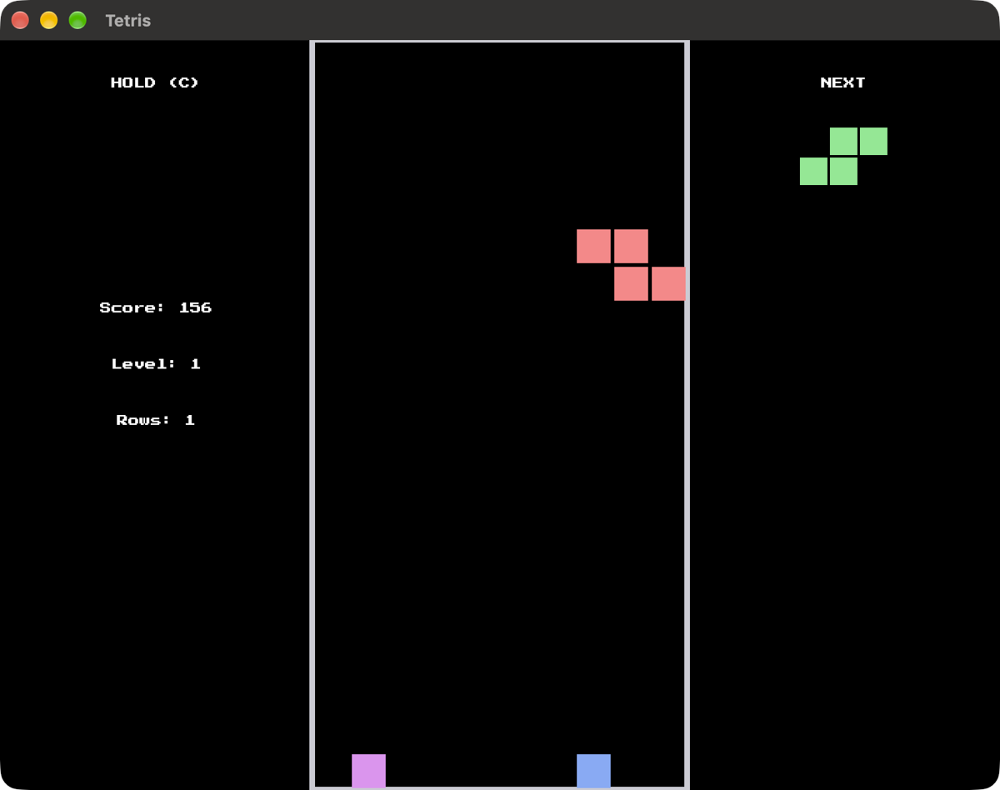

# tetris

Tetris built on [blitzkit](https://github.com/jvalol/blitzkit), the third game
on that engine after pong and snake.

## The project

Part of [blitzkit](https://github.com/jvalol/blitzkit), a graphics engine in
Rust and the games built on it: [pong](https://github.com/jvalol/pong),
[snake](https://github.com/jvalol/snake),
[tetris](https://github.com/jvalol/tetris) and
[marble](https://github.com/jvalol/marble).
